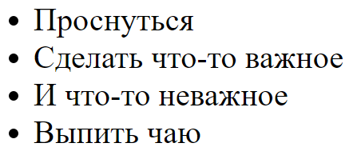

#Домашнее задание №1


1\. Научиться создавать html страницу в Sublime Text 3 и открывать её в браузере
Создать html страницу можно [вот так](http://i.imgur.com/txD40RZ.gifv)  	
Что бы Sublime создал для вас стандартную разметку нужно написать html и нажать таб, вот [пример](http://i.imgur.com/iQHhKrr.gifv)

Или же можете скопировать её отсюда:

```html
<!DOCTYPE html>
<html>
<head>
	<title>Page Name</title>
</head>
<body>
  Page content
</body>
</html>
```


### Не забывайте что после того как вы сделали изменения или правки в html файле нам нужно обязательно его сохранить а потом обновить эту страницу в браузере.

Сохранить html страницу в Sublime Text 3 можно с помощью комбинации клавиш Ctrl + S либо нажав вкладку File и затем пункт Save [пример](http://i.imgur.com/rv57dhM.gifv)
 
2\. Поработать с тегами форматирования текста:
Жирный текст `<b>...</b>`  
Курсив `<i>...</i>`  
Зачёркнутый `<s>...</s>`  
Перенос строки `<br/>`  
Заголовки разных размеров `<h1>...</h1>` - `<h6>...</h6>`  


3\. Поработать с блочными тегами:  
Тег `<div>` - если вы забыли для чего нужен тег - попробуйте поискать ответ в гугле :)  
Не обижайтесь - навык быстро найти верную или полезную информацию очень важен для разработчика. Я как преподаватель обязан вам с этим помочь.  
Тег `<p>` - параграф  
Тег `<hr/>` - горизонтальная линия  

Не забываем что блочные теги занимают всю доступную им ширину. И они при этом смещают на следующую строчку все строчные теги, например такие как `<b>`, `<i>` и `<s>`  
	
4\. Рабоаем с ссылками:  
За это у нас отвечает тег, который выглядит следующим образом:

```html
<a href="http://google.com/">Текст по которому нужно кликнуть</a>
```

Попробуйте вместо http://google.com/ подставить ссылку на свою страницу ВКонтакте или на другие сайты.


5\. Нумерованые списки:

Они выглядят вот так:


```html
<ol>
	<li>Проснуться</li>
	<li>Сделать что-то важное</li>
	<li>И что-то неважное</li>
	<li>Выпить чаю</li>
</ol>
```


Не забывайте про фичу Sublime дублировать строку с помощью комбинации Ctrl + Shift + D
[Вот пример](http://i.imgur.com/ZRxzuBP.gifv)

Также не забывайте про крутую возможноть мультистрочного (мультилайн) редактирования !  
Для этого выделяем текст который повторяется в нашем документе и нажимаем Ctrl + D пока не выделим всё что нам нужно и перемещаемся с помощью клавиш стрелок в нужное нам место.  
[Вот пример](http://i.imgur.com/V7lwPuj.gifv)


6\. Ненумерованые списки:  
После нумерованых нет ничего сложно - просто заменяем `<ol>...</ol>` на `<ul>...</ul>`  
А наши теги `<li>...</li>` остаются на месте:  

```html
<ul>
	<li>Проснуться</li>
	<li>Сделать что-то важное</li>
	<li>И что-то неважное</li>
	<li>Выпить чаю</li>
</ul>
```



Попбруйте сделать свои списки, например список покупок.


7\. Таблицы
Вот структура простой таблицы:

```html
<table border="1">
	<tr>
		<td>1</td>
		<td>2</td>
	</tr>
	<tr>
		<td>3</td>
		<td>4</td>
	</tr>
</table>
```

Тег `<table>...</table>` у нас всего лишь “говорит” браузеру что сейчас начнеться разметка таблицы.  
Тег `<tr>` и `</tr>` начинают и заканчивают ряд в таблице.  
А тег `<td>` и `</td>` создает ячейку, и только между этими тегами стоит писать текст который мы хотим увидеть в таблице !

И вот что должно получиться в итоге:


Одним из ваших заданий будет сделать табличку (давайте для простоты сделаем её уже заполненой) для игры в крестики-нолики что бы у вас получился такой результат:


И следующем уроке я хочу что бы вы мне ответили на вопрос - тег `<table>...</table>` блочный или строчный ?

8\. Играемся с цветом текста  
В этом нам поможет тег `<font>...</font>` например:

```html
<font color="skyblue">Slightly blue text</font>
<font color="red">Maybe you like bloody mary cocktail ?</font>
<font color="white">I'm invisible !</font>
```

Пробуем разные цвета, названия и шестнадцатеричные значения которых можно найди здесь: http://www.w3schools.com/colors/colors_names.asp  

Если есть желание - можете добавить красок втаблицу с крестиками и ноликами:


На этом всё !
Помните что вы всегда можете задать вопрос в *Дискорде*