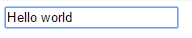
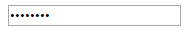
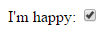
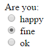
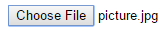
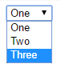
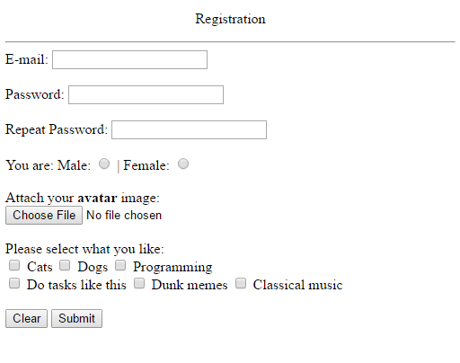

#Домашнее Задание №2

1. Добавление картинок

Если наша картинка в той же папке что и файл index.html, то добавить картинку на страницу можем следующим образом:

```html

```

Если же картинка находиться в подпапке, например, с названием “pictures”, то путь к картинке будет выглядеть вот так:

```html

```

Тег `` непарный, поэтому помним что закрывающий тег ему не нужен.


2. Формы, поля ввода и другие элементы

Все теги которые имеют отношение к формам (например поля ввода) должны находиться внутри тегов `<form>...</form>`

За создание элементов ввода отвечает следующий тег:


```html
<input type="..." name="..." placeholder="..."/>
```

В атрибуте name мы указываем название элемента, например:

```html
<input type="text" name="login"/>
```

Атрибут _placeholder_ выступает в качестве подсказки пользователю о предназначении нашего элемента ввода, например:

```html
<input type="text" name="login" placeholder="Enter your login"/>
```


Атрибут _type_ отвечает за тип создаваемого элемента, например:

| Значение _type_ | Описание                                                                   | Результат |
|-----|--------------------------------------------------------------|-----------|
|`text`| Обычное поле для ввода текста||
|`password`| Поле для ввода пароля - заменяет текст на звездочки||
|`checkbox`| Элемент который работает как “галочка”. Его можно выбрать и отменить выбор ||
|`radio`| Похож на элемент “галочку”, только пользователь может выбрать одну||
|`file`| Позволяет выбрать файл на вашем компьютере||


---


Тег для создания списка:
Этот тег похож на теги `<ol>...</ol>` и `<ul>...</ul>` 

```html
<select>
  <option>One</option>
  <option>Two</option>
  <option>Three</option>
</select>
```



На домашнюю обработку оставляю вам следующее:


Тег `<textarea>...</textarea>`
Информацию об этом теге и не только, вы можете почитать здесь:
http://htmlbook.ru/html/input
http://www.w3schools.com/tags/tag_input.asp


Выравние текста с помощью тега `<p>...</p>`
http://htmlbook.ru/html/p
http://www.w3schools.com/tags/tag_p.asp

Как создать кнопку в html форме
http://htmlbook.ru/html/button
http://www.w3schools.com/tags/tag_button.asp

Также вам нужно будет в рамках домашнего задания сверстать следущую html-форму для регистрации пользователя:



Сделанное задание добавьте пожалуйста на сайте http://codepen.io/