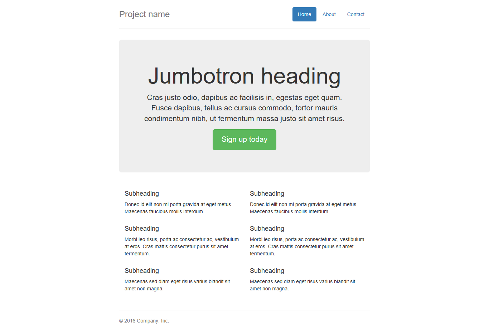

#Домашнее задание №3

Материалы которые вам пригодятся для выполнения домашнего задания помимо записаного видео:

http://www.w3schools.com/cssref/pr_font_font-size.asp  
http://www.w3schools.com/cssref/sel_hover.asp  
http://www.w3schools.com/cssref/sel_active.asp  
http://www.w3schools.com/cssref/sel_focus.asp  
http://www.w3schools.com/cssref/sel_visited.asp  
http://www.w3schools.com/cssref/pr_dim_width.asp  
http://www.w3schools.com/cssref/pr_dim_height.asp  
http://www.w3schools.com/css/css_border.asp  
http://www.w3schools.com/cssref/css3_pr_border-radius.asp  
http://www.w3schools.com/css/css_padding.asp  
http://www.w3schools.com/css/css_margin.asp  
http://www.w3schools.com/cssref/css3_pr_text-shadow.asp  

Помните что если у вас есть сложности с английским материалом, вы можете попробовать поискать русскоязычную версию на http://htmlbook.ru/

В рамках домашнего задания необходимо сверстать следующую страницу:

Выполнять ДЗ можете у себя на компьютере а результат залить на codepen либо же заархивировать и отправить мне в личнку в Дискорд.
И пожалуйста не забудьте что я просил вас подумать над темой вашего личного проекта.