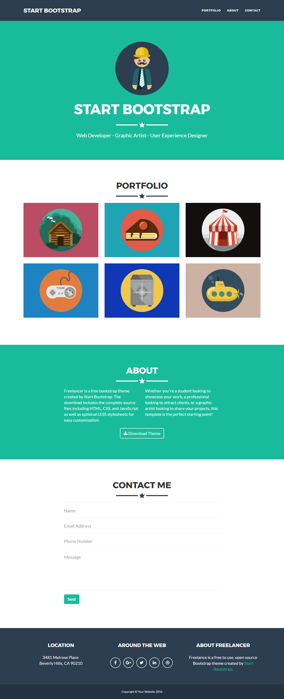

#Домашнее задание #7

Полезные ссылки:

 - http://getbootstrap.com/
 - https://daneden.github.io/animate.css/
 - https://pugjs.org/api/getting-started.html
 - https://www.w3schools.com/cssref/sel_element_pluss.asp
 - https://sass-scss.ru/
 - http://www.sassmeister.com/ - скомпилировать SASS в CSS
 - http://lesscss.org/
 - http://less2css.org/ - скомпилировать LESS в CSS

В рамках этого домашнего задание вам нужно сверстать дизайн который, находиться ниже используя компоненты и класы с сайта http://getbootstrap.com/. Это значит что сетка должна быть сделана с помощью бутстрапа. Остальные элемента сайта можете стилизировать используя CSS. Либо попробовать поработать с LESS или SASS.

 

###Внешний вид сайта на компьютере:

